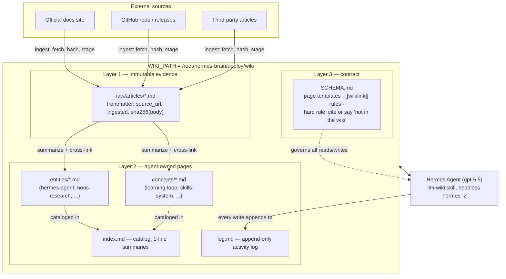
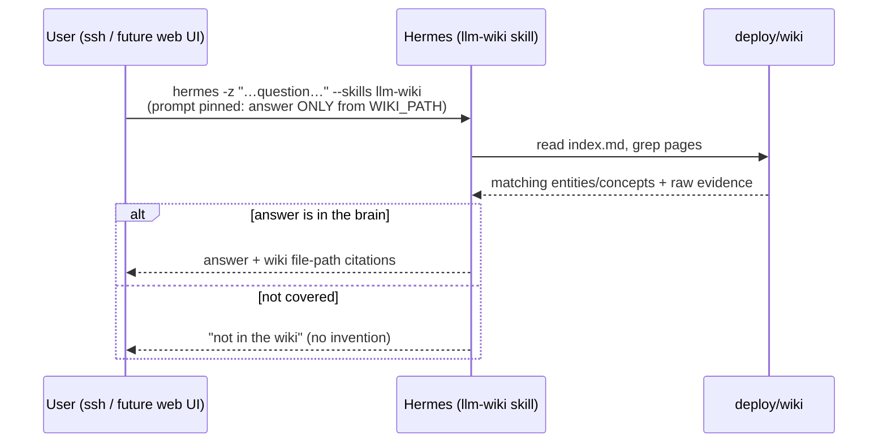
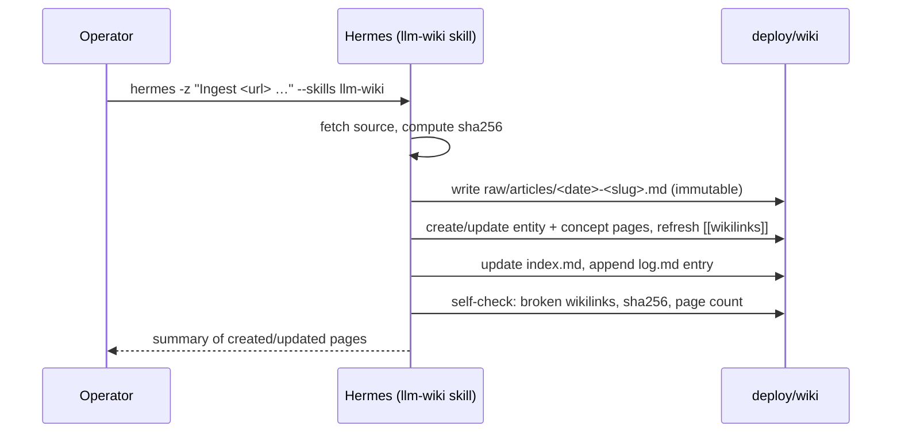
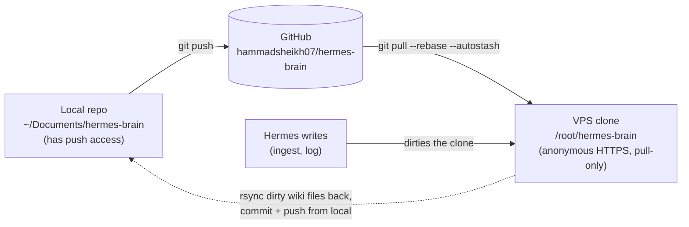

# Architecture — how the brain works

The brain is a plain-markdown wiki (Karpathy's LLM-Wiki pattern) that Hermes Agent maintains
and answers from. No vector DB, no embeddings: retrieval is grep + `index.md`, storage is git.
The live copy Hermes reads is `deploy/wiki/` on the VPS, addressed via `WIKI_PATH`.

## Knowledge flow — three layers, three operations

Layer 1 is never edited after ingest — every claim in Layer 2 cites back into it. Layer 2 is
what queries read; pages cross-reference each other with `[[wikilinks]]` so one ingest can
update many related pages consistently. Layer 3 is the operating contract the skill loads.

## Query path

Two facts proven by the [test suite](test-report-2026-07-02.md): approval gates can stay ON
(`--yolo` is unnecessary), and the wiki-only pin in the prompt is **load-bearing** — without
it Hermes browses the live web and the knowledge base is bypassed (finding F2).

## Ingest path

Measured cost: queries 35–56s each; a full ingest touching 12 pages took ~4.5 min. Ingest is
the token-heavy step but batch and infrequent.

## Sync topology — git is the transport

Curated edits flow left→right (edit locally → push → pull on VPS). Hermes-authored edits flow
right→left: the VPS clone has no push credential, so its dirty files are rsynced to the local
repo, committed there, pushed, and the clone is then reset to origin — content identical,
history clean. `--autostash` exists because the skill writes `log.md`/`index.md` between pulls.

## Repo map

| Path | Role |
|---|---|
| `deploy/wiki/` | **The live brain** — llm-wiki skill format, what the VPS serves |
| `wiki/`, `schema.md`, `index.md`, `log.md` | Project-native wiki format (original POC contract) |
| `bin/lint.sh`, `bin/query.sh` | Deterministic, LLM-free lint/search for the repo-format wiki |
| `ingest/sync_docs.py` | Stages exported markdown into `raw/` with provenance + dedup |
| `tests/` | Knowledge test runner + raw outputs (9/9 pass) |
| `docs/` | Implementation docs, test report, this file |
| `web/` | v2 web chat UI scaffold (mock mode; will call the query path above) |
